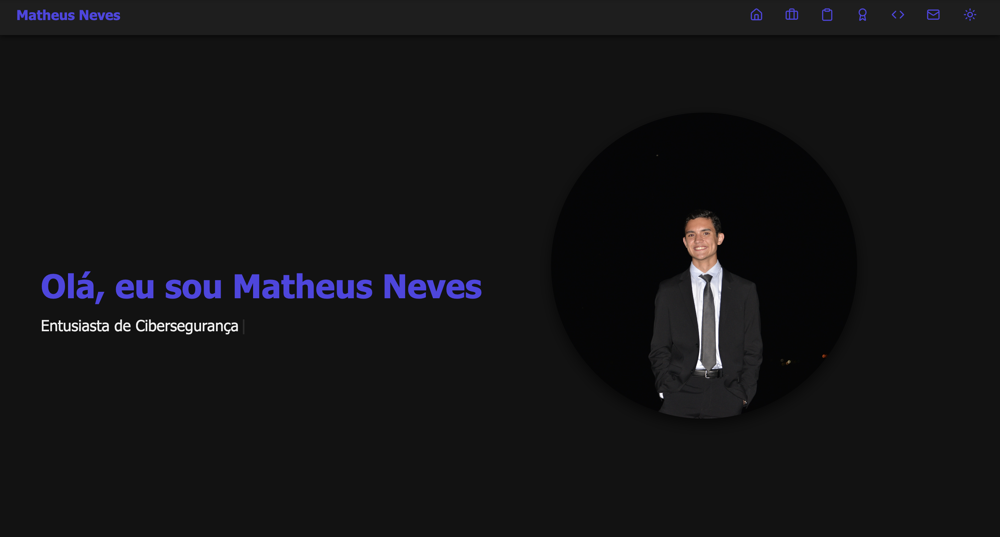

# 🌐 Portfólio - Matheus Neves Soares Pereira

Bem-vindo ao meu portfólio profissional! Este site foi desenvolvido para apresentar minha trajetória como desenvolvedor de software, destacando meus projetos, certificações, experiências e habilidades de forma interativa e moderna.

## 🔗 Link do Site

👉 [Acesse o Portfólio Online](https://matheusnsp.github.io/Portfolio)

---

## 📸 Captura de Tela



---

## 🛠️ Tecnologias Utilizadas

* **React** — biblioteca principal para construção da interface
* **Vite** — ferramenta de build rápida e moderna
* **Framer Motion** — animações suaves e interativas
* **JavaScript, HTML5, CSS3** — base da construção web
* **GitHub Pages** — hospedagem gratuita do site
* **Responsive Design** — otimizado para dispositivos móveis e desktops
* **Modo Claro/Escuro** — suporte dinâmico de tema com persistência via `localStorage`

---

## ✨ Funcionalidades

* Alternância entre idiomas (Português/Inglês)
* Transições animadas ao rolar a página
* Seções dinâmicas: Projetos, Experiências, Certificações, Skills e Contato
* Efeito máquina de escrever para apresentação inicial
* Dark Mode com tema persistente
* Deploy automatizado via GitHub Pages

---

## 🚀 Como Rodar Localmente

1. Clone o repositório:

   ```bash
   git clone https://github.com/matheusnsp/Portfolio.git
   cd Portfolio
   ```

2. Instale as dependências:

   ```bash
   npm install
   ```

3. Execute localmente:

   ```bash
   npm run dev
   ```

4. Acesse no navegador:

   ```
   http://localhost:5173
   ```

---

## 🔄 Deploy para GitHub Pages

Este projeto utiliza Vite, e a publicação está configurada para o GitHub Pages no branch `gh-pages`.

### Scripts:

* Build:

  ```bash
  npm run build
  ```

* Deploy:

  ```bash
  npm run deploy
  ```

### Configuração em `vite.config.js`:

```js
export default defineConfig({
  base: '/Portfolio/',  // Caminho correto do repositório
  plugins: [react()],
});
```

---

## 📊 Carregamento de Imagens com Vite

### Opção 1: Usando a pasta `public/` e `import.meta.env.BASE_URL`

Ideal para imagens como fotos, logos e arquivos PDF que você quer acessar diretamente pelo navegador.

```js
const baseURL = import.meta.env.BASE_URL;
const imagem = `${baseURL}foto.jpg`;
```

No JSX:

```jsx

```

### Opção 2: Usando `src/assets/` e import direto

Mais segura e recomendada para imagens usadas apenas no código.

```js
import foto from './assets/foto.jpg';


```

---

## 📂 Estrutura de Pastas

```
/public
  ├─ foto.jpg
  ├─ logo.png
  ├─ portfolioL.png
  └─ portfolioB.png
/src
  ├─ components/
  ├─ App.jsx
  └─ index.css
vite.config.js
package.json
README.md
```

---

## 📄 Licença

Este projeto é de uso pessoal e está disponível apenas como referência para fins educacionais e profissionais. Para mais informações, entre em contato comigo.

---

## 👨‍💻 Sobre Mim

Sou Matheus Neves, desenvolvedor de software com ênfase em aplicações modernas e seguras. Tenho experiência em desenvolvimento full stack, cibersegurança e integração de IA. Confira meu portfólio completo no site acima.

---

## 📢 Contato

* Email: [matheusnevessp@gmail.com](mailto:matheusnevessp@gmail.com)
* LinkedIn: [linkedin.com/in/matheusnsp](https://www.linkedin.com/in/matheusnsp)
* GitHub: [github.com/matheusnsp](https://github.com/matheusnsp)
